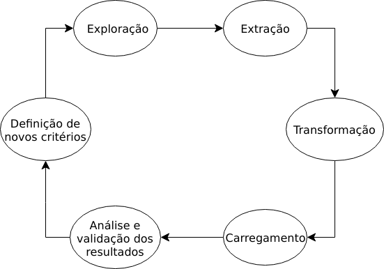

```{r setup, include=FALSE}
knitr::opts_chunk$set(echo = TRUE)
```

## Introdução e Contextualização

A evolução da tecnologia e a facilidade do acesso a internet proporcionam a geração e obtenção de informações dos mais diversos assuntos. Já as redes sociais, que conectam pessoas e organizações a partir de interesses ou valores em comum, são um dos maiores exemplos dessa fonte e troca de informações aproximação. Como fonte de dados referentes à pesquisas no Brasil, foi criado um cadastro nacional de currículos de pesquisadores em 1999. Criado pelo Conselho Nacional de Desenvolvimento e Tecnológico (CNPq) é chamado Currículo Lattes.

Já no ano de 2007 foi ultrapassada a marca de 1 milhão de currículos. Como uma
rede social de pesquisadores, se tornou uma fonte de informação para criação e análise destes dados, que
antes era pouco aproveitado, servindo para avaliar dados em escalas muito pequenas. 
Para o perfil de pesquisador existem informações de alta relevância,
como publicações científicas, projetos de pesquisa e citações de outros pesquisadores, patentes registradas, sejam orientadores, pesquisadores ou orientandos. [1]

No Brasil existe o Programa Institutos Nacionais de Ciência e Tecnologia (INCT) que possui metas que abrange todo território nacional como possibilidade de mobilizar e agregar os melhores grupos de pesquisa em áreas de fronteira da ciência e em áreas estratégicas para o desenvolvimento sustentável do país; impulsionar a pesquisa científica básica e fundamental competitiva internacionalmente; estimular o desenvolvimento de pesquisa científica e tecnológica de ponta associada a aplicações para promover a inovação e o espírito empreendedor, em estreita articulação com empresas inovadoras, nas áreas do Sistema Brasileiro de Tecnologia (Sibratec).


Além de promover o avanço da competência nacional nas devidas áreas de atuação, criando ambientes atraentes e estimulantes para alunos talentosos de diversos níveis, do ensino médio ao pós-graduado, o Programa também se responsabilizará diretamente pela formação de jovens pesquisadores e apoiará a instalação e o funcionamento de laboratórios em instituições de ensino e pesquisa e empresas, proporcionando a melhor distribuição nacional da pesquisa científico-tecnológica, e a qualificação do país em áreas prioritárias para o seu desenvolvimento regional e nacional. Os Institutos Nacionais devem ainda estabelecer programas que contribuam para a melhoria do ensino de ciências e a difusão da ciência para o cidadão comum. [2]

O objetivo desse projeto foi fazer um levantamento e análise de produção técnica de patentes dos pesquisadores que fazem parte dos INCTs.


## Referencial Teórico


## Metodologia 

A metodologia usada foi

```{r metodology, echo=FALSE, fig.align='center', fig.cap="A caption", out.width = '60%', fig.pos = '!h'}

```


This is an R Markdown document. Markdown is a simple formatting syntax for authoring HTML, PDF, and MS Word documents. For more details on using R Markdown see <http://rmarkdown.rstudio.com>.

When you click the **Knit** button a document will be generated that includes both content as well as the output of any embedded R code chunks within the document. You can embed an R code chunk like this:


## Conclusão


## Referências Bibliográficas

[1] DIGIAMPIETRI, L. A. ; MENA-CHALCO, J. P. ; ALCÁZAR, J. J. P. ; TUESTA, E. F. ; DELGADO, K.
V. ; MUGNAINI, R. ; SILVA, G. S. . Minerando e Caracterizando Dados de Currículos Lattes. In: Brazilian
Workshop on Social Network Analysis and Mining (BraSNAM), 2012, Curitiba, PR, Brazil. Anais do XXXII
Congresso da Sociedade Brasileira de Computação, 2012.

[2] http://inct.cnpq.br/sobre/