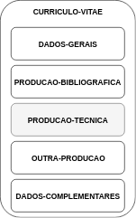

```{r setup, include=FALSE}
knitr::opts_chunk$set(echo = TRUE)
```

## Introdução e Contextualização

A evolução da tecnologia e a facilidade do acesso a internet proporcionam a geração e obtenção de informações dos mais diversos assuntos. Já as redes sociais, que conectam pessoas e organizações a partir de interesses ou valores em comum, são um dos maiores exemplos dessa fonte e troca de informações aproximação. Como fonte de dados referentes à pesquisas no Brasil, foi criado um cadastro nacional de currículos de pesquisadores em 1999. Criado pelo Conselho Nacional de Desenvolvimento e Tecnológico (CNPq) é chamado Currículo Lattes.

Já no ano de 2007 foi ultrapassada a marca de 1 milhão de currículos. Como uma
rede social de pesquisadores, se tornou uma fonte de informação para criação e análise destes dados, que
antes era pouco aproveitado, servindo para avaliar dados em escalas muito pequenas. 
Para o perfil de pesquisador existem informações de alta relevância,
como publicações científicas, projetos de pesquisa e citações de outros pesquisadores, patentes registradas, sejam orientadores, pesquisadores ou orientandos. [1]

No Brasil existe o Programa Institutos Nacionais de Ciência e Tecnologia (INCT) que possui metas que abrange todo território nacional como possibilidade de mobilizar e agregar os melhores grupos de pesquisa em áreas de fronteira da ciência e em áreas estratégicas para o desenvolvimento sustentável do país; impulsionar a pesquisa científica básica e fundamental competitiva internacionalmente; estimular o desenvolvimento de pesquisa científica e tecnológica de ponta associada a aplicações para promover a inovação e o espírito empreendedor, em estreita articulação com empresas inovadoras, nas áreas do Sistema Brasileiro de Tecnologia (Sibratec).

Além de promover o avanço da competência nacional nas devidas áreas de atuação, criando ambientes atraentes e estimulantes para alunos talentosos de diversos níveis, do ensino médio ao pós-graduado, o Programa também se responsabilizará diretamente pela formação de jovens pesquisadores e apoiará a instalação e o funcionamento de laboratórios em instituições de ensino e pesquisa e empresas, proporcionando a melhor distribuição nacional da pesquisa científico-tecnológica, e a qualificação do país em áreas prioritárias para o seu desenvolvimento regional e nacional. Os Institutos Nacionais devem ainda estabelecer programas que contribuam para a melhoria do ensino de ciências e a difusão da ciência para o cidadão comum. [2]

O objetivo desse projeto é realizar análises exploratórias para testar a viabilidade do uso desses dados como indicadores de potencial de inovação de grupos de pesquisa, em particular INCTs.


## Referencial Teórico

### Registros e Patentes

No Brasil, o Instituto Nacional da Propriedade Industrial (INPI), uma autarquia federal vinculada ao Ministério da Indústria, Comércio Exterior e Serviços, é responsável pela gestão do sistema brasileiro de concessão e garantia de direitos de propriedade intelectual para a indústria [4]

São serviços do INPI os registros de marcas, desenhos industriais, indicações geográficas, programas de computador e topografias de circuitos integrados, as concessões de patentes e as averbações de contratos de franquia e das distintas modalidades de transferência de tecnologia. Na economia do conhecimento, estes direitos se transformam em diferenciais competitivos, estimulando o surgimento constante de novas identidades e soluções técnicas. [4]

No Currículo Lattes dos pesquisadores no Brasil é possível encontrar as patentes e registros na seção de produção técnica. 
Para este trabalho foram analisados as seguintes produções:

- Patentes e Registros
- Software/Programa de Computador
- Cultivar Registrada
- Cultivar Protegida
- Marca
- Topografia de Circuito Integrado
- Desenho Industrial 


#### Marcas

Marca de produto ou serviço é aquela usada para distinguir produto ou serviço de outro idêntico, semelhante ou afim, de origem diversa. De acordo com a legislação brasileira, são passíveis de registro como marca todos os sinais distintivos visualmente perceptíveis, não compreendidos nas proibições legais, conforme disposto no art. 122 da Lei nº 9279/96.

A marca pode ser:

- Nominativa: é aquela formada por palavras, neologismos e combinações de letras e números.  

- Figurativa: constituída por desenho, imagem, ideograma, forma fantasiosa ou figurativa de letra ou algarismo, e palavras compostas por letras de alfabetos como hebraico, cirílico, árabe, etc.

- Mista: combina imagem e palavra.

- Tridimensional: pode ser considerada marca tridimensional a forma de um produto, quando é capaz de distingui-lo de outros produtos semelhantes.


#### Patentes

Patente é uma invenção tecnológica que pode ser um processo ou produto. Também pode ser considerado melhorias no uso ou fabricação de objetos de uso prático, como utensílios e ferramentas, que pode ser uma Patente de Invenção (PI) ou Patente de Modelo de Utilidade (MU). 

#### Desenho Industrial

O registro de Desenho Industrial protege a configuração externa de um objeto tridimensional ou um padrão ornamental (bidimensional) que possa ser aplicado a uma superfície ou a um objeto. No Brasil, o Desenho Industrial é protegido mediante registro, diferente de outros países que utilizam patente. Este registro protege a aparência que diferencia o produto dos demais.

#### Software

Programa de computador ou software é um conjunto de instruções ou declarações a serem usadas direta ou indiretamente por um computador, a fim de obter um determinado resultado. Ele é composto por um código-fonte, desenvolvido em alguma linguagem de programação.

#### Topografia de Circuito Integrado

Topografia de circuito integrado significa uma série de imagens relacionadas, construídas ou codificadas sob qualquer meio ou forma, que represente a configuração tridimensional das camadas que compõem um circuito integrado, e na qual cada imagem represente, no todo ou em parte, a disposição geométrica ou arranjos da superfície do circuito integrado em qualquer estágio de sua concepção ou manufatura. Em outras palavras, é o desenho de um chip.

#### Cultivares

Cultivares são variedades cultivadas de plantas que são obtidas por meio de técnicas de melhoramento genético. (apud Bulsing et al., 2010, p. 259). [3]

Os requisitos necessários para a proteção de cultivares são os seguintes:

• ser produto de melhoramento genético;
• ser uma espécie passível de proteção;
• não ter sido comercializada no exterior há mais de quatro anos ou há mais de seis anos, nos casos de videiras ou
árvores;
• ser distinta, homogênea e estável.

O registro de cultivares habilita a produção e comercialização de sementes no país, enquanto a proteção cobre as obtenções de novas cultivares produzidas pelos programas de melhoramento genético de instituições
de pesquisa e assegura o direito de exploração comercial de uso (royalties), por um determinado período de tempo.


## Metodologia 

Para fazer a análise dos dados seguimos um processo que envolvia a participação ativa do cliente para o maior entendimento do contexto e dos dados que seriam relevantes para atingir o objetivo.
Os dados trabalhados foram os currículos de pesquisadores que fazem parte dos INCTs. Os dados foram disponibilizados pelo
cliente em formato XML, totalizando uma amostra 6.558 currículos.
O processo ocorreu de forma iterativa e se deu início a etapa de exploração após o acesso aos arquivos, seguindo as etapas de extração e transformação dos dados para então realizar o carregamento em uma estrutura de dados padrão. Junto com o cliente é realizado a etapa de análise e validação dos resultados e a definição de novos critérios enquanto houvesse necessidade. A Figura 1 ilustra as etapas que foram seguidas para a realização deste trabalho.


```{r metodology, echo=FALSE, fig.align='center', fig.cap="Etapas da metodologia", out.width = '60%', fig.pos = 'ht'}
knitr::include_graphics("images/metodologia.png")
```

É possível visualizar o repositório aberto em que foi realizado este trabalho: https://github.com/matheusbsilva/lattes_patents 

### 1. Exploração

Foram disponibilizados acesso à 6.558 currículos no formato em XML. Demandou tempo para o entendimento do formato de cada currículo que pode variar algumas _tags_ que depende do histórico e preenchimento de cada perfil. As _tags_ aparecem apenas quando são preenchidas ao menos um campo, desde que não seja obrigatório. Na Figura 2 é possível visualizar a organização macro dos arquivos. 

```{r, echo=FALSE, fig.align='center', fig.cap="Organização de um currículo em XML", out.width = '20%', fig.pos = 'ht'}

```

O campo **produção técnica** foi explorado para a identificação de produção de patentes ou registros.
A princípio não se tinha esse conhecimento sobre quais seriam as _tags_ que teriam as informações buscadas. 
No primeiro ciclo desse processo a busca era por **patentes**, e então após trabalho manual de pesquisar nos arquivos foram encontradas as informações dos campos pedidos para o preenchimento dessas informações.
Essa identificação facilitou a criação do código para a leitura das demais patentes. 
Nas iterações do processo a requisição foi para a busca pelos outros tipos de patentes: marcas, topografia de circuito integrado, desenho industrial, software e cultivares. 
Para cada um deles houve uma busca nos arquivo em busca da identificação das _tags_, já que só encontraria tais informações nos currículos que haviam cadastrados, o que no melhor dos casos muitos currículos teriam ou no pior nenhum, o que dependendo da forma da busca poderia resultar em retrabalho ou gasto de energia desnecessário. 
Todas as patentes e registros foram encontradas na _tag_ produção técnica. 


### 2. Extração

No processo de extração foi necessário o entendimento de outros campos dos currículos visando a forma mais eficiente de extrair esses dados do XML, para então selecionar os dados relevantes para o estudo e descartar os demais.


### 3. Transformação

Nessa etapa acontece os tratamentos das colunas, normalização e agrupamento de dados. Após os tratamentos nos dados dos currículos, juntou as informações sobre os INCTs, visto que todos os pesquisadores fazem parte de algum INCT.

### 4. Carregamento

Os arquivos recebidos podem ter ou não as informações buscadas, assim, nessa etapa, os dados já tratados são exportados em um arquivo XLSX. Arquivo este que pôde ser enviado para que o cliente pudesse analisar e para facilitar a leitura dos arquivos XML. 

### 5. Análise e validação dos resultados

Análises exploratórias são realizadas e os resultados dessas buscas são compartilhadas em reuniões presenciais com o cliente que valida esses resultados, caso estejam condizentes, ou retorna uma sugestão sobre o processo ou resultados.

### 6. Definição de novos critérios

Após analisar os resultados da etapa anterior são definidos novos critérios de identificação dos potenciais de inovação faltantes.


## Conclusão

Conclu


## Referências Bibliográficas


[1] DIGIAMPIETRI, L. A. ; MENA-CHALCO, J. P. ; ALCÁZAR, J. J. P. ; TUESTA, E. F. ; DELGADO, K.
V. ; MUGNAINI, R. ; SILVA, G. S. . Minerando e Caracterizando Dados de Currículos Lattes. In: Brazilian
Workshop on Social Network Analysis and Mining (BraSNAM), 2012, Curitiba, PR, Brazil. Anais do XXXII
Congresso da Sociedade Brasileira de Computação, 2012.

[2] Institutos Nacionais de Ciência e Tecnologia <http://inct.cnpq.br/sobre/>. Acessado em 5 de Dezembro de 2018.


[3] <http://www.agricultura.gov.br/assuntos/insumos-agropecuarios/insumos-agricolas/protecao-de-cultivar/FAQ_SNPC_out2018.pdf>. Acessado em 5 de Dezembro de 2018.


[4] Propriedade Industrial - Ministério da Indústria, Comércio Exterior e Serviços. Disponível em: <http://www.inpi.gov.br/pedidos-em-etapas/entenda>. Acessado em: 6 de Dezembro de 2018.
